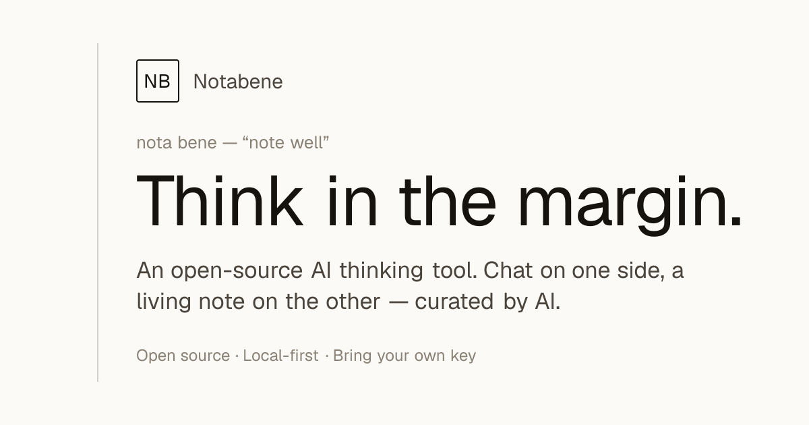
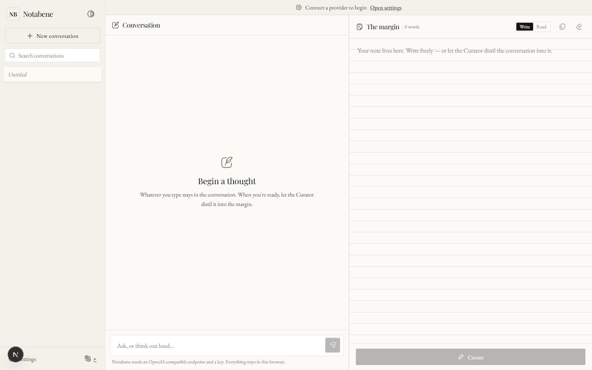

<div align="center">



# Notabene

**Think in the margin.**

A local-first, open-source AI thinking tool. Chat on one side, a living note on the other — an AI **Curator** keeps your words *verbatim* and the AI's *distilled*. Bring your own key.

[](LICENSE)
[](https://nextjs.org)


[**Open the app**](https://notabene-eight.vercel.app/app/) · [العربية](#بالعربية)

</div>

---

## Why Notabene

When you chat with an AI, your own ideas get tangled up in its replies. By the end of a long thread, it's hard to find the one thing *you* decided.

Notabene keeps them apart. On the left, a **conversation**. On the right, a **note** that stays yours — until you ask the **Curator** to fold in the parts worth keeping.

> *nota bene* — "note well". The mark scribes once wrote in the margin, beside the line that mattered.

<div align="center">
  
</div>

## How it works

1. **Talk** — chat with your AI as you always would. Think out loud.
2. **Curate** — press *Curate*. The Curator reads the whole conversation and your current note, then returns an updated note: your worthwhile messages kept **verbatim**, the AI's replies **distilled** — and anything you wrote yourself is preserved, never clobbered. You review the proposal and accept or discard it.
3. **Keep** — edit the note freely. It's plain Markdown, saved on your device, forever yours.

## Features

- **Chat and note, side by side** — your thinking stays yours; the AI's answers stay theirs, until you choose what to keep.
- **The Curator** — one click merges the conversation into your note; your words verbatim, the AI's summarised, with a preview before anything changes.
- **Bring your own key** — OpenRouter, Groq, DeepSeek, Mistral, Together, a local model (Ollama / LM Studio), or anything OpenAI-compatible.
- **Local-first & private** — no accounts, no servers, no telemetry. Conversations and notes live in your browser (IndexedDB); your key stays in `localStorage` and is sent only to your provider.
- **Arabic & English, truly** — right-to-left and left-to-right from the first pixel, with classic type in both scripts.
- **Open source** — MIT-licensed, static, and yours to fork and self-host.

## Bring your own key

Notabene talks to anything that implements the OpenAI **Chat Completions** API. Because it runs entirely in your browser, the provider must allow cross-origin (CORS) requests:

| Provider | Base URL | Browser (CORS) |
| --- | --- | --- |
| OpenRouter | `https://openrouter.ai/api/v1` | ✅ |
| Groq | `https://api.groq.com/openai/v1` | ✅ |
| DeepSeek | `https://api.deepseek.com/v1` | ✅ |
| Mistral | `https://api.mistral.ai/v1` | ✅ |
| Together AI | `https://api.together.xyz/v1` | ✅ |
| Ollama (local) | `http://localhost:11434/v1` | ⚙️ set `OLLAMA_ORIGINS=*` |
| LM Studio (local) | `http://localhost:1234/v1` | ⚙️ enable CORS in the app |
| OpenAI | `https://api.openai.com/v1` | ❌ blocked from the browser — use a gateway or a small proxy |

The Settings panel tells you, per provider, whether a direct browser connection will work.

## Run locally

```bash
git clone https://github.com/AHKH3/notabene.git
cd notabene
npm install
npm run dev          # http://localhost:3000
```

Build a static site (output in `out/`):

```bash
npm run build
```

## Deploy

Notabene is a fully static export — host the `out/` folder anywhere. The live
build runs on **[Vercel](https://notabene-eight.vercel.app)**.

- **Vercel / Netlify** *(recommended)* — import the repo; no configuration needed (leave `NEXT_PUBLIC_BASE_PATH` unset). Set `NEXT_PUBLIC_SITE_URL` to your domain for correct canonical/OG URLs.
- **GitHub Pages** — the included workflow ([`.github/workflows/deploy.yml`](.github/workflows/deploy.yml)) builds with the correct `basePath` and publishes on push. Enable Pages → *Source: GitHub Actions*.
- **Any static host** — `npm run build` and serve `out/`.

## Privacy

There is no backend. Your conversations and notes never leave your browser, and your API key is used only to reach the provider you choose. Clearing your browser storage (or *Settings → Clear all local data*) removes everything.

## Tech

Next.js 16 (App Router, static export) · React 19 · Tailwind CSS v4 · TypeScript · IndexedDB (`idb-keyval`) · [Hugeicons](https://hugeicons.com). No analytics, no tracking.

## Contributing

Issues and pull requests are welcome. Keep it monochrome, keep it local-first.

---

<div align="center">

## بالعربية

**نوتابيني — فكِّر في الهامش**

</div>

أداة تفكير بالذكاء الاصطناعي: محلية، مفتوحة المصدر، وتعمل بالكامل داخل متصفحك.

حين تحادث ذكاءً اصطناعيًا، تختلط أفكارك بردوده. يُبقيها **نوتابيني** منفصلة: على جهةٍ **محادثة**، وعلى الأخرى **هامش** يبقى لك — حتى تطلب من **«المُحرِّر»** أن يضمّ إليه ما يستحقّ البقاء: كلامك **بنصِّه**، وكلام الذكاء الاصطناعي **مُلخَّصًا**، مع الحفاظ على ما كتبته بنفسك دون المساس به.

- **محادثة وهامش جنبًا إلى جنب** — أفكارك تبقى لك، وإجابات الذكاء تبقى لها حتى تختار ما تحتفظ به.
- **المُحرِّر** — بنقرة واحدة يدمج المحادثة في هامشك، مع معاينة قبل أي تغيير.
- **اجلب مفتاحك** — OpenRouter وGroq وDeepSeek وMistral ونماذج محلية وأي خدمة متوافقة مع OpenAI.
- **محلي وخاص** — بلا حسابات ولا خوادم ولا تتبّع؛ كل شيء في متصفحك.
- **عربي وإنجليزي بحقّ** — دعم كامل لليمين واليسار وخطوط كلاسيكية في اللغتين.

**التشغيل:** `npm install` ثم `npm run dev`. **النشر:** ملفات ثابتة في `out/` تُستضاف في أي مكان.

افتح التطبيق: <https://notabene-eight.vercel.app/app/>

---

<div align="center">

Created by [**Abdelrahman Hamada**](https://github.com/AHKH3) · MIT License

</div>
